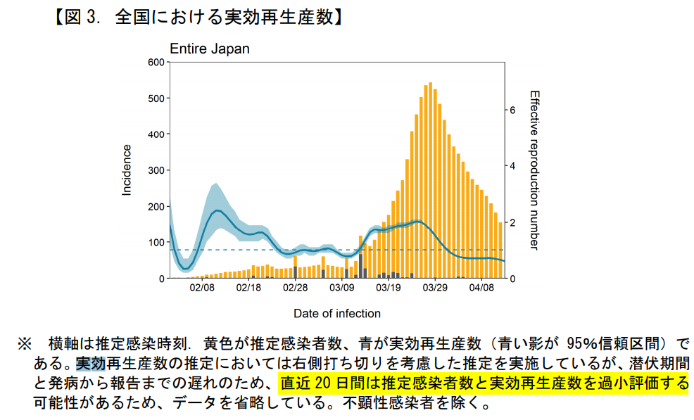
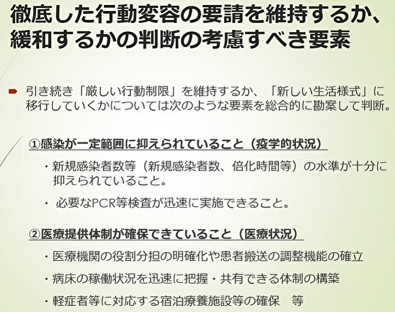
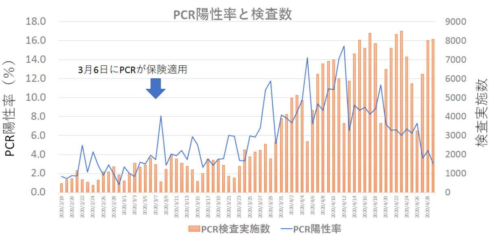
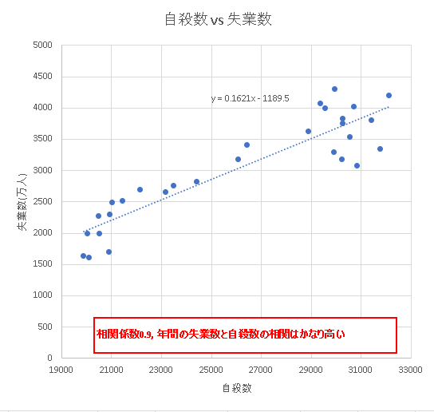
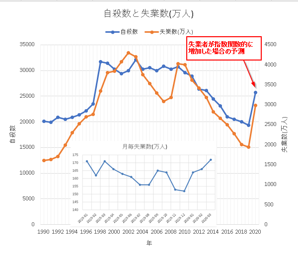
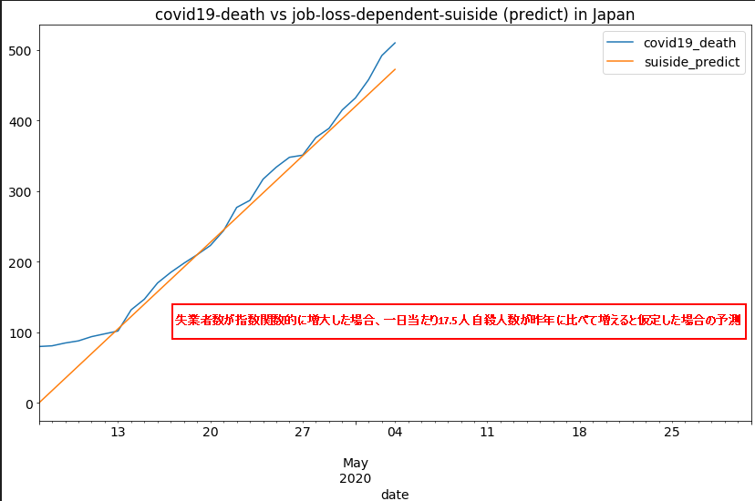

# covid19-JP
最近の専門家提言資料とオープンデータから日本の目標と課題を整理していくぅ。
* [実効再生産数は数値目標として微妙](#実効再生産数は数値目標として微妙)
* [政府と専門家が提言内で暗に示唆している数値目標](#政府と専門家が提言内で暗に示唆している数値目標)
* [緊急事態の解除条件](#緊急事態の解除条件)
* [PCR検査数増やしても緊急事態解除はできない](#PCR検査数増やしても緊急事態解除はできない)
* [失業数は数値目標に加えるべき](#失業数は数値目標に加えるべき)
* [わたしたちにできること](#わたしたちにできること)

## 実効再生産数は数値目標として微妙
[5/1のスッキリ](https://www.j-cast.com/tv/2020/05/01385311.html?p=all)で皆さん知りたがっていた実効再生産数 (1人の感染者が何人に移すか)。

ドイツが毎日公表しているとかで謎の信頼を得ているこの数字ですが、直近20日間については実際の再生産数より**低く**見積もる可能性を日本の専門家達は指摘しています。

(5/1専門家提言より抜粋)

この数字は感染爆発を事前に検知するために活用されるべきなのに、直近20日間は低く見積もるんですよ。微妙すぎる。

日本の専門家達はこの数字より**倍化時間**(何日で感染者数が倍になるか)が指標として使えると提言内で示唆しています。

## 政府と専門家が提言内で暗に示唆している数値目標
テレビでは中々教えてくれないですけど、専門家提言資料にはたくさん数字が出てきます:
* 人工呼吸器やECMO(人工肺)より病床数が不足 (使用率`38.2`%, 東京`100`%オーバー)
* 軽症者の療養施設に関して39都道府県で`13000`室が利用可能だが地域別に見ると不足
* 空床数見える化に参加している医療機関は`46`%, 拡充必須
* 倍化時間`3`日を下回るとオーバーシュート傾向, 要緊急事態宣言
* 新規感染者数が`100`人を超えているとコントロールできない

いくつかの数字の根拠が曖昧なため、首相が宣言できるレベルではないです。

ただ、実効再生産数ではなく倍化時間を指標として緊急事態宣言を出したことでオーバーシュートを防げた。
陽性率ではなく新規感染者数を追うことで感染爆発リスクを回避してきた。
他国やメディアに惑わされず専門家が事実ベースで対策を講じていることは間違いないと思います。

## 緊急事態の解除条件
これも実は専門家提言に曖昧だが書いてある(5/1専門家提言より抜粋):

数字は適当ですが、例えば下記4つが専門家提言から読み取れる日本の指標(KPI)です。

| 指標 | 条件 | (地域ごとの)緊急事態 |
| :--- | :---: | :---: |
| 新規感染者数 | e.g. 50人以上の場合 | 発動 |
| 倍化時間 | e.g. 3日以下の場合 | 発動 |
| 病床使用率 | e.g. 50%以下の場合 |解除  |
| 空床可視化参加率 | e.g. 80%以上の場合 | 解除 |

## PCR検査数増やしても緊急事態解除はできない
専門家提言資料にはPCR検査数と陽性率についても数字が出ています。
しかし検査数を増やして陽性率が多少増減したところで、
* 新規感染者が多い限り感染経路特定が追いつかない
* 病床数が足りない限り医療崩壊は防げない

という観点から、緊急事態解除には何ら影響を及ぼさないです。本質ではないのです。

## 失業数は数値目標に加えるべき

以下2つのデータから失業数の増加を推定しました:
* [人口動態統計に基づく自殺死亡数](https://www.mhlw.go.jp/stf/seisakunitsuite/bunya/hukushi_kaigo/seikatsuhogo/jisatsu/jinkoudoutai-jisatsusyasu.html)
* [労働力調査 長期時系列データ](https://www.stat.go.jp/data/roudou/longtime/03roudou.html#hyo_1)

| (年間)自殺数と失業数の相関 | (年間)推定失業数と自殺数 | 
| :--- | :---: | 
|  |  | 

月毎の失業数から指数近似した場合(最悪のケース)、2020年の失業数は2019年より10万4千人多くなります。線形近似した関数から自殺数を推定すると、2020年は2019年より6415人多くなります。これは1日17.5人増える計算になります。緊急事態宣言発令からこの増加が発生していると仮定して自殺増加数を推定したプロットが以下です:

covid19による死者数も重ねました。現状はまだcovid19による死者数が上回っています。しかしいつまでも緊急事態宣言を続けていてはいずれ自殺者数が上回ります。この数字を無視して緊急事態の宣言・解除をするのはいささか乱暴に思われます。失業数および増加率が一定の値を超えた場合、速やかに緊急事態を解除すべきです。

## わたしたちにできること
* 地域ごとの倍化時間可視化による感染爆発リスクの監視
* 新規感染者多い地域での混雑度可視化による混雑回避
* 病床使用率高い地域での軽症者数可視化, 利用可能施設とのマッチング
* 空床状況見える化不参加病院について情報収集, ボトルネック解消

## 参考:
* 人工呼吸器, ECMO使用数: https://covid19.jsicm.org/
* 人工呼吸器, ECMO使用数(word): https://www.ja-ces.or.jp/wordpress/wp-content/uploads/2020/03/d17eb111750dd2702c626ae3fb46f21c.pdf
* 病床使用率: https://www.stopcovid19.jp/
* 5/4専門家提言資料: https://www.mhlw.go.jp/content/10900000/000627553.pdf
* 5/1専門家提言資料: https://news.yahoo.co.jp/story/1675