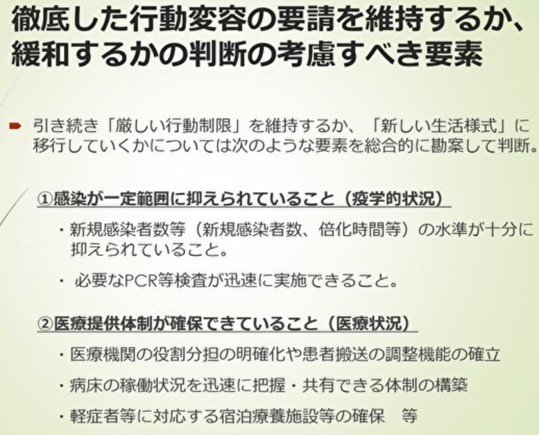

# covid19-JP
最近の専門家提言資料とオープンデータから日本の目標と課題を整理していくぅ。
* [実効再生産数は数値目標として微妙](#実効再生産数は数値目標として微妙)
* [政府と専門家が提言内で暗に示唆している数値目標](#政府と専門家が提言内で暗に示唆している数値目標)
* [緊急事態の解除条件](#緊急事態の解除条件)
* [わたしたちにできること](#わたしたちにできること)

# 実効再生産数は数値目標として微妙
[5/1のスッキリ](https://www.j-cast.com/tv/2020/05/01385311.html?p=all)で皆さん知りたがっていた実効再生産数 (1人の感染者が何人に移すか)。

ドイツが毎日公表しているとかで謎の信頼を得ているこの数字ですが、直近20日間については実際の再生産数より**低く**見積もる可能性を日本の専門家達は指摘しています。

(5/1専門家提言より抜粋)

この数字は感染爆発を事前に検知するために活用されるべきなのに、直近20日間は低く見積もるんですよ。微妙すぎる。

日本の専門家達はこの数字より**倍化時間**(何日で感染者数が倍になるか)が指標として使えると提言内で示唆しています。

# 政府と専門家が提言内で暗に示唆している数値目標
テレビでは中々教えてくれないですけど、専門家提言資料にはたくさん数字が出てきます:
* 人工呼吸器やECMO(人工肺)より病床数が不足 (使用率`38.2`%, 東京`100`%オーバー)
* 軽症者の療養施設に関して39都道府県で`13000`室が利用可能だが地域別に見ると不足
* 空床数見える化に参加している医療機関は`46`%, 拡充必須
* 倍化時間`3`日を下回るとオーバーシュート傾向, 要緊急事態宣言
* 新規感染者数が`100`人を超えているとコントロールできない

いくつかの数字の根拠が曖昧なため、首相が宣言できるレベルではない。

ただ、実効再生産数ではなく倍化時間を指標として緊急事態宣言を出したことでオーバーシュートを防げた。陽性率ではなく新規感染者数を追うことで感染爆発リスクを回避してきた。他国やメディアに惑わされず専門家が事実ベースで対策を講じていることは間違いない。

# 緊急事態の解除条件
これも実は専門家提言に曖昧だが書いてある:

(5/1専門家提言より抜粋)

分かりづらいのでmilestoneとissueに置き換えました:
1. 感染数を制御できるか
    * 新規感染者数がxx人を上回らないこと
    * 倍化時間がxx日を下回らないこと
2. 医療崩壊を防げるか
    * 病床使用率がxx%を下回ること
    * 空床可視化の参加率をxx%を上回ること

(https://github.com/nyoshimura/covid19-JP/milestones)

上記4つが、専門家提言から読み取れる日本の指標(KPI)です。

# わたしたちにできること
* 地域ごとの倍化時間可視化による感染爆発リスクの監視
* 新規感染者多い地域での混雑度可視化による混雑回避
* 病床使用率高い地域での軽症者数可視化, 利用可能施設とのマッチング
* 空床状況見える化不参加病院について情報収集, ボトルネック解消

# 参考:
* 人工呼吸器, ECMO使用数: https://covid19.jsicm.org/
* 人工呼吸器, ECMO使用数(word): https://www.ja-ces.or.jp/wordpress/wp-content/uploads/2020/03/d17eb111750dd2702c626ae3fb46f21c.pdf
* 病床使用率: https://www.stopcovid19.jp/
* 5/4専門家提言資料: https://www.mhlw.go.jp/content/10900000/000627553.pdf
* 5/1専門家提言資料: https://news.yahoo.co.jp/story/1675